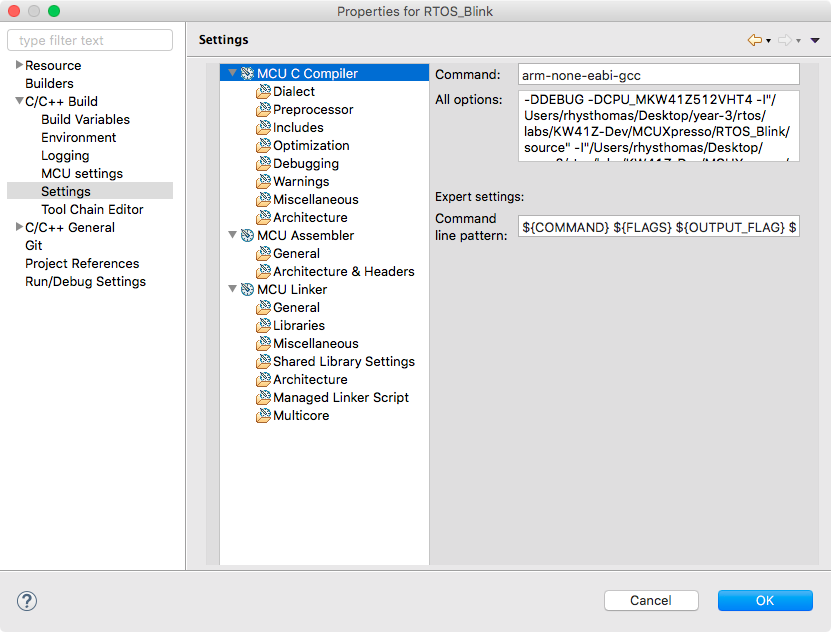

# ARM-Cortex Development using ARM GCC Toolchains

The ARM toolchains can be downloaded from [here](https://developer.arm.com/open-source/gnu-toolchain/gnu-rm).

---

## Compiling

Firstly the compilation commands were extracted from MCUXpresso by adding the `--verbose` flag to the makefile settings. Then when building, the commands were copied into a bash script. In order to simplify the `CFLAGS` and `LDFLAGS` some unecessary commands were removed from the Makefile within MCUXpresso before running.

These settings were found within Project > Properties C/C++ Build > Settings. These are then added to the `CFLAGS` and `LDFLAGS` for the gcc compiler and linker.



```
Compiling: CMSIS/system_MKW41Z4.o
Compiling: freertos/croutine.o
Compiling: freertos/event_groups.o
Compiling: freertos/fsl_tickless_lptmr.o
Compiling: freertos/fsl_tickless_systick.o
Compiling: freertos/heap_4.o
Compiling: freertos/list.o
Compiling: freertos/port.o
Compiling: freertos/queue.o
Compiling: freertos/tasks.o
Compiling: freertos/timers.o
Compiling: source/Board_LED.o
Compiling: source/RTOS_Blink.o
Compiling: source/mtb.o
Compiling: startup/startup_mkw41z4.o
```

---

## Dependancies

The lines in the makefile that generates the dependancy file is

```makefile
Makefile.deps: $(SRC)
	$(CC) $(CFLAGS) $(INC) -MM $^ > Makefile.deps
```

What is does, is from every source file passed into the makefile, it adds it to `Makefile.deps` which makes a build routine for every required object file, based on what files it requires. For example:

```makefile
timers.o: freertos/timers.c freertos/FreeRTOS.h freertos/FreeRTOSConfig.h \
 freertos/projdefs.h freertos/portable.h \
 freertos/deprecated_definitions.h freertos/portmacro.h \
 freertos/mpu_wrappers.h freertos/task.h freertos/list.h freertos/queue.h \
 freertos/timers.h
Board_LED.o: source/Board_LED.c source/Board_LED.h CMSIS/MKW41Z4.h \
 CMSIS/core_cm0plus.h CMSIS/core_cmInstr.h CMSIS/cmsis_gcc.h \
 CMSIS/core_cmFunc.h CMSIS/system_MKW41Z4.h
...
...
```

These then follow the generic build command supplied by,

```makefile
%.o: %.c
	@echo 'Compiling: $@'
	$(CC) $(CFLAGS) $(INC) -o $@ $<
```

---

## Linking

Linking was failing because it could not find the linker scripts required. `cannot open linker script file RTOS_Blink_Debug.ld: No such file or directory`. Nowhere in the MCUXpresso build commands does it make the linker files so I am unsure as to where they're coming from.

Regardless, I have copied the necessary linker scripts from the MCUXpresso output, and added them to my GNU directory.

Linking now passes, it takes the object files generated at the compiling stage and combines them into one executable and returns the code size thanks to the `-print-memory-usage` linker flag.

```
Building target: RTOS_Blink.bin
Memory region         Used Size  Region Size  %age Used
   PROGRAM_FLASH:       12396 B       512 KB      2.36%
            SRAM:       18976 B       128 KB     14.48%
Finished building target: RTOS_Blink.bin
```

---

## Cleaning

Since this is a bash script and not a makefile we need to make our own clean command which removed the generated object and dependancy files.

```bash
find . -name '*.o' -or -name '*.d' | xargs rm
```

This command finds all `.o` and `.d` files in the directory and passes them to the `rm` command, which deletes them.

Now with the addition of the Makefile, `make clean` removes the compiled object files for the project, makefile dependancies and the generated binary.

```makefile
clean:
	@echo 'Cleaning...'
	-rm $(OBJ)
	-rm Makefile.deps
	-rm RTOS_Blink.bin
```

---

## Debugging

The Makefile works to compile and link the code into a binary file, however I have not yet figured out how to flash the board or debug on the target.
