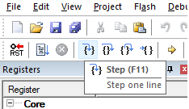
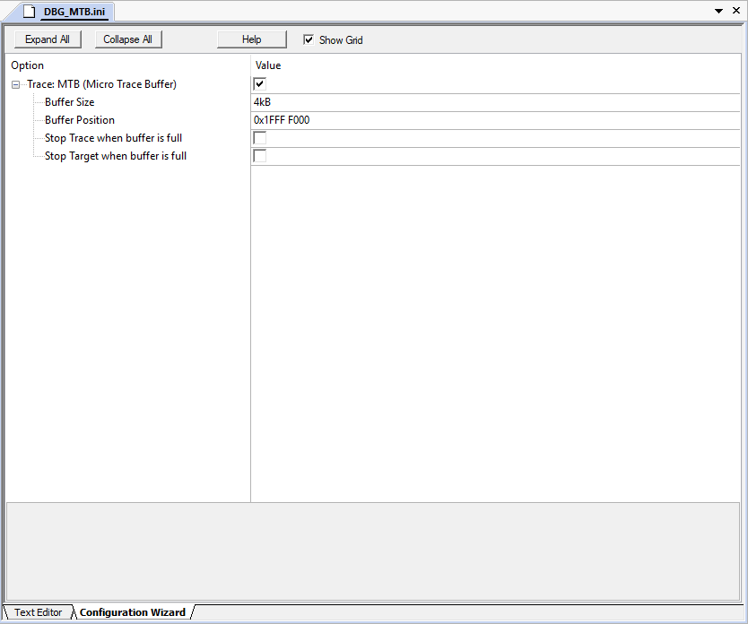
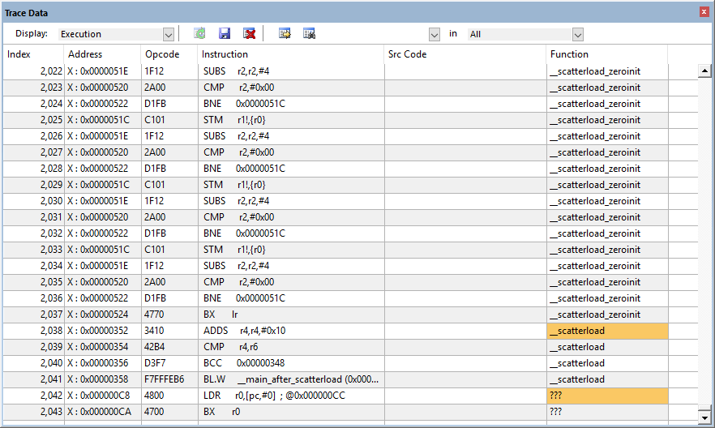

# ARM-Cortex Development using Keil IDE

## Flashing

To flash the device:

1. Connect the device.
2. Go to Flash > Configure Flash Tools... > Debug > Use: *J-LINK / J-TRACE Cortex*.

    

3. Then to find the device select Settings and the J-LINK connection will discover the device. This handles all the addressing issues allowing you to program the device.

    

4. Hit ok on all windows until you have returned to your code.
5. Build for target.
6. Load (Agree to any T&C's that might pop up).
7. *You may have to reset the board (press SW1) after flashing to run the code.*

---

## Installing Packages

Keil comes with a useful package installer to download the required tools on a per-board basis.

1. Open the package installer () from inside Keil.
2. From here you can then install the necessary packages for your board. In the case of this module, we need the FreeRTOS port for the KW41Z from NXP.

    

---

## Creating a New Project

Keil makes it easy to import these downloaded packages when making a new project.

1. Go to Project > New uVision Project...

    

2. Import the packages you want.

    

3. You will notice that some of the boxes are yellow, this means the package you want to include requires other packages. In the case of the above screenshot, `FreeRTOS::RTOS:Core` also requires `FreeRTOS::RTOS:Heap` and `Keil::Device:Startup`.

    

4. Now that all the packages are ok, we can finish creating the project, giving a structure as below.

    

---

## Debugging

Debugging your source for the target processor is made easy in larger IDEs such as Keil; the default setup is to debug using a simulator. This setting can be found in Project > Options for Target... > Debug.

To add code breakpoints just click to the side of the line you would like to stop at, and a red circle will appear.

One all the breakpoints are set, the debugger is run by selecting Debug > Start/Stop Debug Session (Ctrl+F5).

The debugger comes with a vast array of tools. On the left hand panel is a list of all the registers, e.g. the program counter, and their contents. It also opens up the source code for where you currently are in the step. For example the first breakpoint opens up `startup_MKW41Z4.s` which initialises the micro-controller and points to the main function to run.

As can be seen in the comments box in the bottom left, this program uses ~8kB of space compared to our maximum of 32kB allowed in the free version of Keil.

To step through the code, there are the *Step*, *Step Over*, *Step Out* and *Run to Cursor* buttons in the top left corner.

* Step: Progress to next line.
* Step Over: If the current line contains a function call, Step Over runs the code then suspends execution at the first line of code after the called function returns.
* Step Out: Continues running code and suspends execution when the current function returns (the debugger skips through the current function).
* Run the Cursor: Equivalent to setting a temporary breakpoint and runs the code until it reaches the selected line.

### Debugging on the Target

Back in the project debug options mentioned at the start of this section you can switch over to the hardware debugging with J-LINK. *(See [flashing](#flashing) section on how to register the device)*.

This way, rather than simulating the operation of the code, you can actually see it perform on your target hardware. It is still advised however that you test critical/complex functions in some sort of harness on the host, before subjecting it to your constrained device.

After stepping through the same code on the hardware, one will notice that the lights will not start flashing until you step into *(or rather, over)* the `vTaskStartScheduler()` function. Since the first three functions of main set up the LEDs and create the two tasks. Only when the scheduler starts do the tasks actually run.

*Note: When running to the end of the program, i.e. there are no more breakpoints, the debugger is then unable to update the state of registers etc. in real-time.*

### Other Debugging Tools.

Keil offers a number of tools to help the debugging process, such as:

* PORT state debugging.

    

* RTOS stack information.

    

* Logic analyser.
* Code coverage.
* Serial monitor.
* And more…

The idea of these tools is to provide detail of the current states of the processor without obfuscating the developer. That way bugs can be found and acted upon very quickly.

### Using the MTB

To use the MTB, reference to [App Node 232](http://www.keil.com/appnotes/docs/apnt_232.asp) was required. Through various other sources it was clear that the MTB doesn't work with the J-LINK debugger and so the CMSIS-DAP debugger was installed.

#### Installing Bootloader/Debugger

The CMSIS-DAP debugger can be found [here](https://www.nxp.com/support/developer-resources/run-time-software/kinetis-developer-resources/ides-for-kinetis-mcus/opensda-serial-and-debug-adapter:OPENSDA#FRDM-KW41Z). The binary that you download for the board is copied onto the USB volume when in bootloader mode. Next you open up Keil to program the board.

Be sure to swap the J-LINK debugger for CMSIS-DAP in Target Options > Debug > Use...

#### Programming and Reading the MTB

Adapted from section 18 of the aforementioned app note.

1. Within the app note example code there is `DBG-MTB.ini`. Go to Target Options > Debug and add the file to the box saying "Load Application at Startup". Then press Edit, this opens the .ini file into the editor.

    

2. Within the editor window (in configuration wizard) you can choose to enable the MTB and allocate buffer space etc.

    

3. Then build the target as before, and enter debug mode ().

#### The Trace Output

From debug mode in Keil, after programming the board, open Trace Data to show the contents of the MTB.

