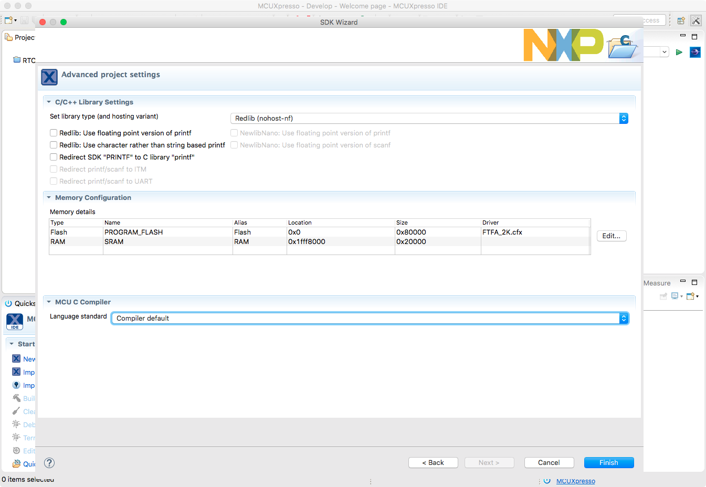
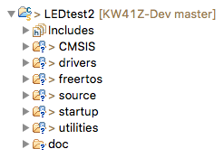
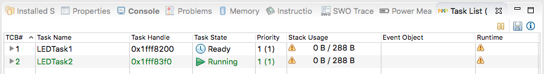
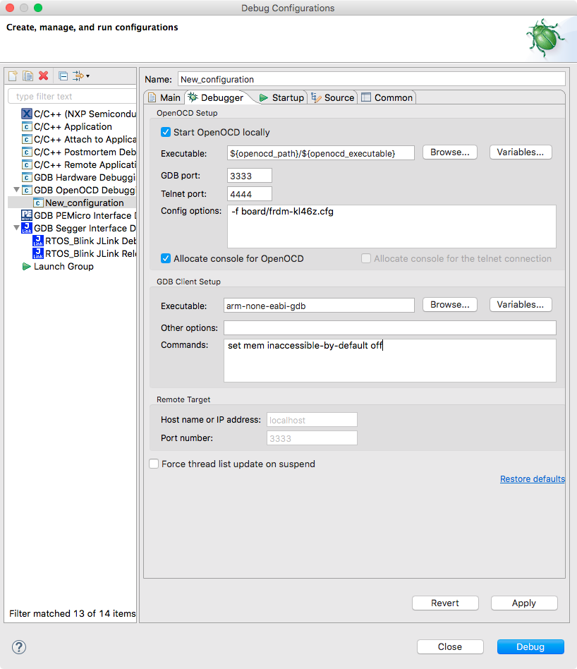
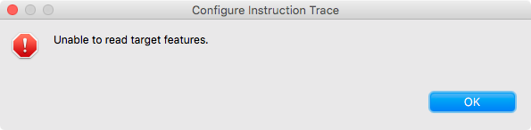

# ARM-Cortex Development using MCUXpressoIDE

## Creating a Project

To make a new project:
1. Select File > New > Project...
2. MCUXpresso IDE > New C/C++ Project > Next.
3. Choose the `frdmkw41z` SDK and hit next.
4. Enter the name for the intended project, and choose which OS and driver utilities you want to add, then hit next.

    

5. Choose any advanced settings, such as flash and RAM locations then finish.

    

6. The files added into this project by the IDE are then shown in the project tree to the left of the editor.

    

## Debugging

To run the MCUXpresso debugger on the target, you need to press the blue beetle icon (). MCUXpresso will then build the project, attempt to find a connected board, and flash the created binary. It will then run the program to the first line of `main` and then break.

To progress through the debugger, the instructions are very similar to that of the Keil IDE; in fact many IDEs adopt the same functionality. If you're done step-by-step debugging, press the run button () to allow the target to free run.

Below is an example of the LED task data being sent from the MCU to the IDE while running. This allows us to see how each task is behaving within the system and whether it's triggering or prioritising correctly.

### Installing CMSIS-DAP Probe

The J-LINK debugger was found to not work with MTB, so the OpenSDA (CMSIS-DAP) probe was used instead. The below downloads are required:

* [OpenSDA firmware for KW41Z](https://www.nxp.com/support/developer-resources/run-time-software/kinetis-developer-resources/ides-for-kinetis-mcus/opensda-serial-and-debug-adapter:OPENSDA#FRDM-KW41Z)
* [OpenSDA debugger for host machine](https://github.com/gnu-mcu-eclipse/openocd/releases)
* [Download tutorial](https://gnu-mcu-eclipse.github.io/debug/openocd/)

Once all the files are downloaded you must first update the debugger firmware onboard the KW41Z. This is done by connecting it in the bootloader mode (hold down reset when pluging in the USB) then dragging `k20dx_frdmkw41z_if.bin` into the device folder. The disk should then unmount and remount with a new name; DAPLINK.

Once the firmware is updated we then need to configure MCUXpresso for debugging the DAPLINK. This requires the second download in the above list. Then inside MCUXpresso goto Help > Install New Software and in the "Work for" field type "GNU ARM Eclipse - http://gnuarmeclipse.sourcecforge.net/updates" and download GNU ARM C/C++ OpenOCD Debugging.

Then goto Run > Debug Configurations... and create a new GDB OpenOCD configuration.

After then pressing Debug you are then able to run the code on your board as before.

### MTB

Now that CMSIS-DAP is installed, MTB should work as according to [this document](https://www.nxp.com/docs/en/quick-reference-guide/MCUXpresso_IDE_Instruction_Trace.pdf). It **does not** however, since when I press "Record Continuously" it returns the following error.

There are no notes in the aforementioned document to help with this problem and there appears to be little documentation about it online. Further investigation will be required.
