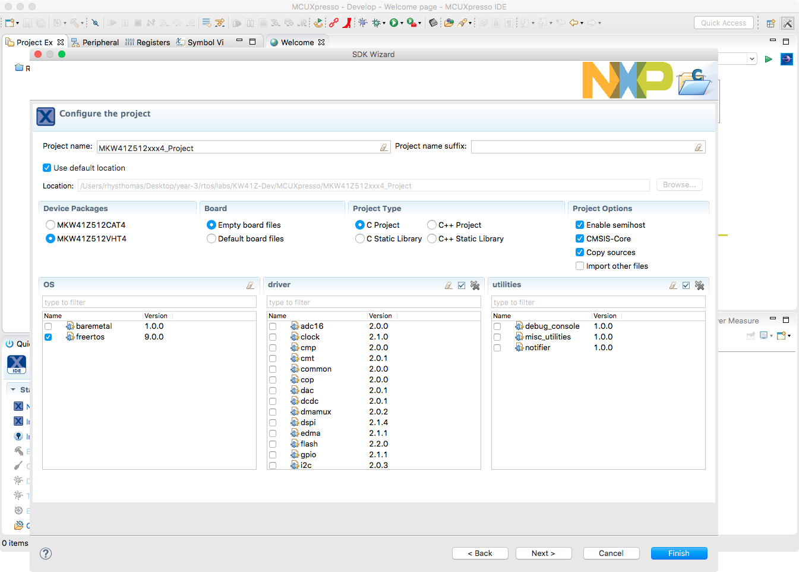

# ARM-Cortex Development using MCUXpressoIDE

## Creating a Project

To make a new project:
1. Select File > New > Project...
2. MCUXpresso IDE > New C/C++ Project > Next.
3. Choose the `frdmkw41z` SDK and hit next.
4. Enter the name for the intended project, and choose which OS and driver utilities you want to add, then hit next.

    

5. Choose any advanced settings, such as flash and RAM locations then finish.

    

6. The files added into this project by the IDE are then shown in the project tree to the left of the editor.

    

## Debugging

To run the MCUXpresso debugger on the target, you need to press the blue beetle icon (). MCUXpresso will then build the project, attempt to find a connected board, and flash the created binary. It will then run the program to the first line of `main` and then break.

To progress through the debugger, the instructions are very similar to that of the Keil IDE; in fact many IDEs adopt the same functionality. If you're done step-by-step debugging, press the run button () to allow the target to free run.

Below is an example of the LED task data being sent from the MCU to the IDE while running. This allows us to see how each task is behaving within the system and whether it's triggering or prioritising correctly.

